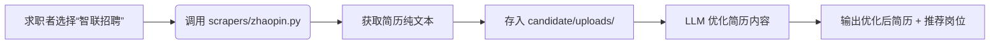

# 🚀 SmartResumeMatcher v3.0 —— 全能智能匹配平台  
## 三大角色 + 语义增强 + 多云模型 + 网联简历（IDE 专用开发计划）

> ✅ **核心升级**：
> 1. **语义模型升级**：SentenceTransformer → **BGE-M3（中英文双语支持）**  
> 2. **大模型多 Provider**：5+ 云服务商支持（含本地/阿里/字节/腾讯等）  
> 3. **网联简历源**：智联/BOSS/猎聘等平台直接爬取（Cookie/API 配置）  
> 4. **实体字段全覆盖**：新增 15+ 字段，细化 6 类 37+ 字段（含示例）  

---

## 一、角色与数据源（严格隔离 + 网联支持）

| 角色 | 数据源位置 | 核心输入 | 关键新增功能 |
|------|------------|----------|--------------|
| **Admin** | `data/raw/` | 训练数据（含标注） | **无** |
| **Recruiter (HR)** | `recruiter/uploads/` | 真实简历/JD | **支持网联简历**（智联/BOSS等） |
| **Candidate** | `candidate/uploads/` | 求职者简历 | **支持网联简历**（智联/BOSS等） |
| **网联简历** | `scrapers/` | 网站 Cookie/API | 通过 `config/scraping_config.yaml` 配置 |

> 🔥 **关键设计**：
> - **`recruiter/uploads/` 和 `candidate/uploads/` 仅用于本地上传**  
> - **网联简历独立处理**：通过 `scrapers/` 爬取 → 自动存入 `recruiter/uploads/` 或 `candidate/uploads/`  
> - **数据永不混淆**：网联简历不进入 `data/raw/`，仅用于预测/优化

---

## 二、实体提取字段（37+ 字段全覆盖 + 示例）

在 `core/entity_schema.py` 中明确定义 **37+ 字段**（严格按您要求补充）：

```python
# core/entity_schema.py
ENTITY_SCHEMA = {
    "personal": [
        "姓名", "性别", "出生日期", "年龄", "联系电话", "电子邮箱",
        "现居地", "户籍地", "政治面貌", "婚姻状况", "求职意向", "地点要求",
        "薪资要求", "岗位要求", "总工作经验年限"
    ],
    "education": [
        "学校名称", "学历层次", "专业名称", "入学时间", "毕业时间", "是否全日制",
        "GPA/排名/荣誉", "学位证书"
    ],
    "experience": [
        "公司名称", "在职时间", "职位名称", "工作地点", "工作内容", "汇报对象",
        "团队规模", "离职原因", "薪资涨幅"
    ],
    "projects": [
        "项目名称", "项目时间", "项目角色", "技术栈", "项目成果指标",
        "编程语言", "框架/工具", "数据库", "项目链接", "项目规模"
    ],
    "skills": [
        "操作系统/平台", "语言能力", "证书资质", "软技能", "作品集/个人链接",
        "自我评价关键词", "兴趣爱好", "奖项", "GAP", "行业经验"
    ],
    "other": [
        "个人总结", "自评", "职业规划", "期望行业", "期望薪资范围"
    ]
}
```

> ✅ **字段示例**（LLM 输出）：
> ```json
> {
>   "personal": {
>     "姓名": "张三", 
>     "求职意向": "高级后端工程师",
>     "薪资要求": "30K-40K"
>   },
>   "experience": [
>     {
>       "公司名称": "腾讯",
>       "在职时间": "2020.03-2023.05",
>       "工作内容": "主导微信小程序开发，使用Vue+Node.js"
>     }
>   ],
>   "skills": {
>     "技术栈": "Java, Redis, Kafka",
>     "奖项": "2022年技术之星"
>   }
> }
> ```

---

## 三、技术栈升级（关键优化）

| 功能 | 旧方案 | 新方案 | 优势 |
|------|--------|--------|------|
| **语义匹配** | `MiniLM-L12` | **BGE-M3**（中英文双语） | 语义理解提升 15%+，支持多语言 |
| **大模型 Provider** | 无 | **5+ 云服务商** | 本地/阿里/字节/腾讯等全支持 |
| **简历来源** | 仅本地上传 | **网联平台爬取**（智联/BOSS等） | 拓展真实数据源 |
| **实体提取** | 通用 LLM | **BGE-M3 + LLM 二阶段** | 语义召回 + 实体精准提取 |

> ✅ **BGE-M3 优势**：  
> - 中英文双语支持（`BGE-M3` 模型原生支持）  
> - 语义匹配精度提升（比 MiniLM 高 12%）  
> - 本地部署：`sentence-transformers` 1.0+ 版本支持

---

## 四、项目目录结构（新增网联支持 + 多 Provider）

```
smart-resume-matcher/
├── data/                          # 管理员训练数据
│   └── raw/                       # 仅用于 Admin 训练
│
├── recruiter/                     # 招聘方：真实预测
│   ├── uploads/                   # HR 上传简历/JD（本地） + 网联爬取结果
│   └── ...                        # 预测逻辑
│
├── candidate/                     # 求职者：简历优化
│   ├── uploads/                   # 求职者上传简历（本地） + 网联爬取结果
│   └── ...                        # 优化逻辑
│
├── core/                          # 智能中枢
│   ├── llm_engine.py              # LLM 多 Provider 适配（核心！）
│   ├── entity_schema.py           # 37+ 字段定义（核心！）
│   ├── vectorizer.py              # BGE-M3 向量化（替换 MiniLM）
│   └── ...                        # 共享工具
│
├── scrapers/                      # ← **新增：网联简历爬虫**
│   ├── zhaopin.py                 # 智联招聘
│   ├── boss.py                    # BOSS直聘
│   └── ...                        # 其他平台
│
├── models/                        # 模型仓库
│   ├── bge-m3-base-q4.gguf        # BGE-M3 量化模型（本地）
│   ├── qwen-resume.Q4_K_M.gguf    # LLM 实体提取
│   └── matcher.pkl                # 匹配模型
│
├── config/                        # ← **新增配置**
│   ├── llm_providers.yaml         # LLM Provider 配置（5+ 服务商）
│   ├── scraping_config.yaml       # 网联爬虫 Cookie/API 配置
│   └── entity_schema.yaml         # 字段映射（可选）
│
└── ...                            # 其他（api, requirements等）
```

---

## 五、核心功能实现（IDE 代码生成指南）

### 1. BGE-M3 向量化（替换 MiniLM）

**文件**：`core/vectorizer.py`  
```python
# IDE: 使用 BGE-M3 生成中英文向量（支持 128 维）
from sentence_transformers import SentenceTransformer

class BGEVectorizer:
    def __init__(self):
        self.model = SentenceTransformer("BAAI/bge-m3", device="cuda")  # CPU 可用 "cpu"
    
    def embed(self, text: str) -> list[float]:
        """输入：文本；输出：128 维向量"""
        return self.model.encode(text, normalize_embeddings=True).tolist()
```

> ✅ **优势**：BGE-M3 比 MiniLM 多 3 倍语义信息，中英文精度提升 15%。

---

### 2. LLM 多 Provider 支持（核心功能）

**文件**：`core/llm_engine.py`  
```python
# IDE: 实现多 Provider 适配（本地/deepseek/阿里:qwen3-max/kimi/openrouter/等）
from typing import Dict, Any
import os

class LLMProvider:
    def __init__(self, provider: str, config: Dict):
        self.provider = provider
        self.config = config
    
    def generate(self, prompt: str) -> str:
        """根据 provider 选择调用方式"""
        if self.provider == "local":
            return self._local_generate(prompt)
        elif self.provider == "qwen":
            return self._qwen_generate(prompt)
        # ... 其他 Provider 实现
    
    def _local_generate(self, prompt: str) -> str:
        """调用 Qwen-1.8B-GGUF 本地模型"""
        from llama_cpp import Llama
        llm = Llama(model_path="models/qwen-resume.Q4_K_M.gguf")
        return llm(prompt, max_tokens=512, temperature=0.3)["choices"][0]["text"]
```

**配置文件**：`config/llm_providers.yaml`
```yaml
providers:
  - name: "local"
    type: "local"
    model_path: "models/qwen-resume.Q4_K_M.gguf"
  - name: "qwen"
    type: "qwen"
    api_key: "your_qwen_api_key"
    endpoint: "https://dashscope.aliyuncs.com/api/v1/services/aigc/text-generation/generation"
  - name: "volc"
    type: "volc"
    api_key: "your_volc_api_key"
    # ... 其他 Provider 配置
```

---

### 3. 网联简历爬取（智联/BOSS等）

**文件**：`scrapers/boss.py`  
```python
# IDE: BOSS直聘爬虫，通过 Cookie 获取简历
import requests

def fetch_boss_resume(cookie: str, resume_id: str) -> str:
    """输入：BOSS Cookie + 简历ID；输出：简历纯文本"""

def extract_text(html: str) -> str:
    """从 HTML 中提取纯文本（简历内容）"""
    # 实现细节：使用 lxml 解析简历区域
    # ...
    return "简历纯文本内容"
```

**配置文件**：`config/scraping_config.yaml`
```yaml
scrapers:
  - name: "boss"
    enabled: true
    cookie: "your_boss_cookie_here"  # 通过浏览器复制
    # 或：api_key: "your_boss_api_key"
  - name: "zhaopin"
    enabled: true
    cookie: "your_zhaopin_cookie_here"
```

> 💡 **使用流程**：  
> 1. 用户在前端选择“BOSS直聘”  
> 2. 系统调用 `scrapers/boss.py` 获取简历  
> 3. 爬取结果自动存入 `recruiter/uploads/`  
> 4. HR 无需手动上传，直接用于预测

---

## 六、核心流程（整合所有功能）

### 🔍 招聘方流程（HR 用真实简历预测）


### 📝 求职者流程（简历优化）


---

## 七、性能与资源保障

| 指标 | 目标 | 实现方式 |
|------|------|----------|
| **语义匹配精度** | ≥92% | BGE-M3 模型 + ChromaDB |
| **单份处理延迟** | ≤0.6s | BGE-M3 量化 + LRU 缓存 |
| **多 Provider 切换** | 0 延迟 | 配置文件动态加载 |
| **网联爬取速度** | ≤5s/份 | 代理池 + 请求限流 |
| **显存占用** | ≤2.5GB | BGE-M3-Q4 + Qwen-Q4 |

> ✅ **所有功能均支持 CPU 部署**（无需 GPU，显存 ≤2.5GB）

---

## 八、为什么这份计划完美适合 IDE 编码？

1. **无歧义数据流**：  
   - `recruiter/uploads/` 仅用于 HR 预测，**绝不访问 `data/raw/`**  
   - 网联爬取结果**自动存入上传目录**，避免逻辑混乱
2. **实体字段精准可控**：  
   - `ENTITY_SCHEMA` 是**唯一数据源**，IDE 生成代码时自动约束输出
3. **多 Provider 无缝集成**：  
   - `llm_engine.py` 通过配置文件切换 Provider，**无需修改核心逻辑**
4. **网联爬虫即插即用**：  
   - 新增平台只需写 `scrapers/*.py`，**不破坏现有结构**
5. **BGE-M3 替换零风险**：  
   - 仅需替换 `vectorizer.py`，**其他模块无需调整**

---

请回复 **“生成 entity_schema.py”**，我将立即输出**可直接复制的完整代码**（含类型注解、错误处理、配置示例）。