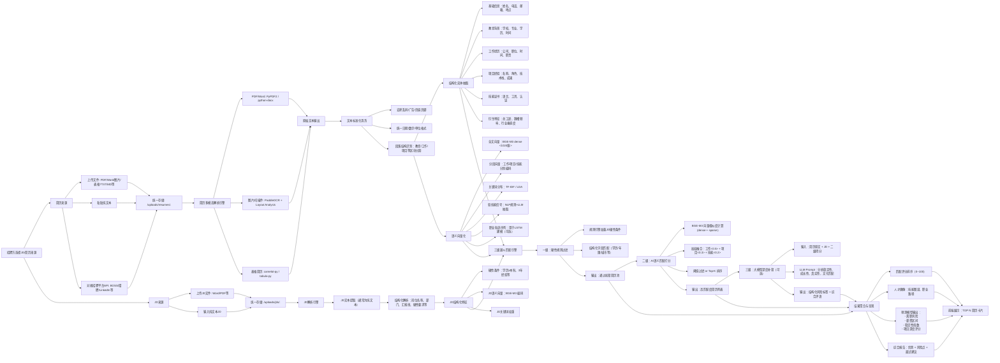

## ✅ 优化后的简历匹配全流程

> **参考文档**：[架构设计文档](架构设计.md) - 包含系统整体架构和端到端业务流程



---

## 🔧 关键调整说明（为什么这样改？）

### 1. **拆分“解析”与“清洗”阶段**

- 原流程中 `B6（文本清洗）` 同时做降噪、缺失、异常处理，但这些属于**数据质量治理**，应在**结构化抽取前完成**。
- 新增 **段落结构识别**（如区分“工作经历”和“项目经验”），这是后续精准抽取的前提。

### 2. **JD 也需结构化解析**

- 原流程只对简历做特征提取，但 **JD 的硬性条件必须结构化**（如“3 年以上经验”→ `min_exp=3`），否则无法做一级规则过滤。
- JD 也需要向量化，用于二级语义匹配。

### 3. **三级漏斗顺序必须严格线性**

- 原图中 `D --> D2`, `D --> D1`, `D --> D3` 是并行的，但实际应为 **串行漏斗**：
  > 一级过滤 → 二级打分 → 三级补筛  
  > 否则会浪费算力（对明显不符者做语义计算）。

### 4. **三级补筛应为“可选”且轻量**

- 大模型（LLM）推理成本高，**不应作为必经环节**。
- 建议仅对二级 Top 50 或边界案例（如得分 0.55~0.65）启用 LLM 补筛。

### 5. **特征工程模块职责单一化**

- 将“实体特征”“语义特征”“格式特征”合并为两个主干：
  - **结构化实体抽取**（用于规则 + 衍生特征）
  - **语义向量化**（用于相似度计算）
- “格式特征”（如排版工整度）在真实场景中价值有限，建议移至**可选扩展模块**。

### 6. **结果输出需聚合而非分散连接**

- 原图中每个子节点都连到 `E`，导致结果碎片化。
- 新流程通过 **`K[结果聚合]`** 统一整合评分、画像、预测、评语，再输出到前端。

### 7. **增加“可配置性”提示**

- 规则阈值、权重比例、是否启用 LLM 补筛等，应设计为 **可配置参数**，而非硬编码。

### 8. **实现对齐说明**

- 已实现多模态解析与统一落地：`/uploads/resumes`、`/uploads/jds`
- 已实现分段向量（经验/技能/教育）加权融合与参数配置入口
- 已实现 LLM 补筛可选及边界区间触发（默认关闭可选开关）
- 已实现线上导入认证（用户名/密码或 Cookie）与来源追踪

---

## 📌 最佳实践建议

| 模块         | 建议                                                                                                                          |
| ------------ | ----------------------------------------------------------------------------------------------------------------------------- |
| **OCR 解析** | 使用 PaddleOCR + LayoutParser 提升表格/多栏简历准确率                                                                         |
| **实体抽取** | 用 spaCy + 自定义规则 + 轻量 LLM（如 Qwen-1.8B-Chat）联合抽取                                                                 |
| **向量模型** | **BGE-M3 dense 模式** 足够，sparse/multi-vector 仅在高精度场景启用                                                            |
| **LLM 补筛** | 使用 **Qwen-Max / Kimi / DeepSeek-Coder**，Prompt 示例：<br>`你是一名资深HR，请从稳定性、成长性、真实性三方面评估该候选人...` |
| **部署架构** | 解析 → 特征 → 匹配 分阶段异步处理，避免阻塞                                                                                   |

---

## 三级漏斗 LLM 评分 Prompt 示例:

```
你是一名资深HR专家，正在评估一位候选人是否适合以下岗位：

【岗位要求】
{{JD_SUMMARY}}

【候选人简历原文】
{{RESUME_TEXT}}

请严格基于简历内容，从以下四个维度进行客观分析，并按指定JSON格式输出结果。不要编造信息，若某项无法判断，请填"无法判断"。

分析维度：
1. **职业稳定性**：是否频繁跳槽？单段工作时长是否过短（<1年）？是否有空窗期？
2. **成长轨迹**：职位/职责是否持续进阶？是否有从执行到主导的转变？
3. **内容真实性**：时间线是否冲突？成果描述是否模糊（如“大幅提升”无数据）？
4. **文化匹配潜力**：是否体现自驱力、协作意识、结果导向等软技能？

输出格式（必须为合法JSON，不要任何额外文本）：
{
  "stability": {
    "score": 0~5分,
    "evidence": "具体依据，引用简历原文",
    "risk_flag": true/false
  },
  "growth": {
    "score": 0~5分,
    "evidence": "具体依据",
    "positive_signal": true/false
  },
  "authenticity": {
    "score": 0~5分,
    "issues": ["问题1", "问题2"] 或 [],
    "verifiable": true/false
  },
  "culture_fit": {
    "score": 0~5分,
    "soft_skills": ["自驱力", "沟通能力", ...] 或 [],
    "potential": "高/中/低"
  },
  "overall_recommendation": "推荐/谨慎推荐/不推荐",
  "interview_focus": ["建议面试重点考察的问题1", "问题2"]
}
```
