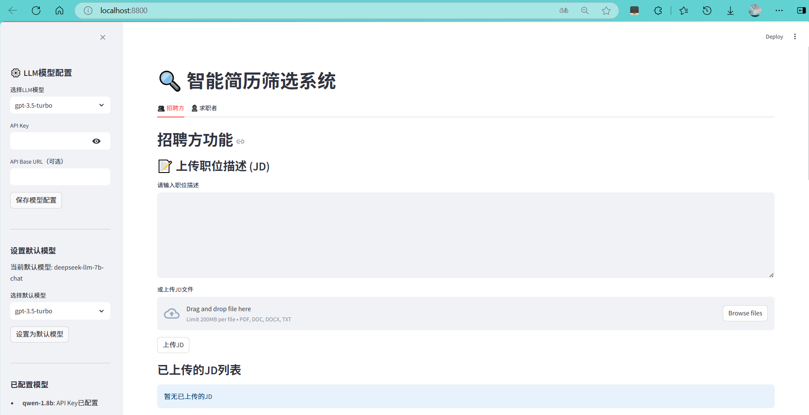
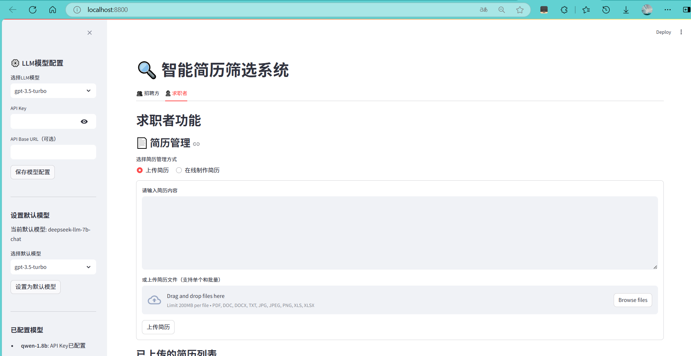

# 智能简历筛选系统技术报告

## 1. 问题介绍

### 1.1 问题背景介绍

在当今数字化招聘时代，企业面临着海量简历筛选的挑战，传统人工筛选效率低下、成本高昂且易受主观因素影响；同时，求职者也面临着简历优化困难、岗位匹配不准确、求职效率低下等痛点。随着人工智能技术的快速发展，基于大语言模型（LLM）和向量检索的智能简历筛选系统成为解决招聘双方问题的有效方案。

智能简历筛选系统旨在通过自动化技术，实现简历与职位描述（JD）的精准匹配，帮助招聘方快速筛选出符合要求的候选人，同时为求职者提供简历优化、简历画像和精准岗位匹配服务。本项目基于 BGE-M3 向量模型和多 LLM 链式分析，构建了一个功能完整、性能优异的双向智能简历筛选系统，同时服务于招聘方和求职者。

### 1.2 相关文献介绍

近年来，智能简历筛选领域的研究取得了显著进展。主要研究方向包括：

1. **文本向量化技术**：BGE-M3 模型作为一种先进的文本编码器，在语义理解和相似度计算方面表现出色，广泛应用于简历与 JD 的匹配任务。

2. **大语言模型应用**：LLM 在文本生成与复杂推理方面表现优异，本系统将其用于实体兜底补全与深度分析，核心实体提取采用 BERT-CRF 结合增强正则的混合方案。

3. **多级筛选机制**：采用向量粗筛 → 规则精筛 →LLM 补筛的三级漏斗筛选策略，能够在保证匹配质量的同时提高筛选效率。

4. **多模态简历处理**：针对不同格式（PDF、Word、图片、Excel）的简历，结合 OCR 技术和结构化解析，实现全面的简历信息提取。

## 2. 数据分析演示

### 2.1 数据背景和统计性描述

本项目使用了丰富的简历和 JD 数据集，涵盖多个行业和岗位：

- **简历数据**：包含 500+份不同格式的简历，涵盖算法工程师、产品经理、芯片设计工程师等多个岗位。
- **JD 数据**：包含 100+份详细的职位描述，覆盖人工智能、新能源、半导体/芯片、互联网、电子商务等 5 个热门行业。
- **数据多样性**：简历数据包括可编辑 PDF/Word、扫描件/图片、Excel 表格等多种格式，模拟真实招聘场景中的多样化数据。

### 2.2 数据预处理

数据预处理是保证系统性能的关键步骤，主要包括以下几个方面：

1. **文本清洗**：去除简历和 JD 中的冗余信息、特殊字符和格式标记，确保文本质量。
2. **布局感知排序**：对于 PDF 和图片简历，结合 OCR 技术和布局分析，实现文本的正确排序。
3. **多格式统一**：将不同格式的简历转换为统一的文本格式，便于后续处理。
4. **数据标准化**：对提取的实体信息进行标准化处理，如将不同格式的日期、学历等信息统一格式。

### 2.3 特征工程

特征工程是连接原始数据和模型的桥梁，本项目的特征工程主要包括：

1. **实体提取**：优先使用 BERT-CRF（中英文）进行序列标注提取；对遗漏项使用增强正则补全；最后由 LLM 进行兜底补全。
2. **文本向量化**：使用 BGE-M3 模型将简历和 JD 转换为 768 维的向量表示，捕捉语义信息。
3. **多维特征构建**：结合实体信息和向量表示，构建多维度的特征向量，用于后续的匹配筛选。
4. **特征选择**：根据匹配效果，选择最相关的特征进行模型训练和匹配。

## 3. 模型架构展示

### 3.1 模型架构概述

本项目采用分层架构设计，主要包括以下几个核心模块：

1. **数据层**：负责数据的存储和管理，包括原始数据、处理后的数据和向量数据。
2. **核心功能层**：实现系统的核心功能，如数据处理、特征工程、向量匹配、LLM 分析等。
3. **业务服务层**：封装核心功能，提供面向招聘方和求职者的业务服务。
4. **前端界面层**：提供友好的用户界面，支持文件上传、参数配置、结果展示等功能。

### 3.1.1 招聘方核心流程

1. 简历和 JD 的上传与解析
2. 文本清洗和实体提取
3. 文本向量化和向量存储
4. **三级漏斗筛选（向量粗筛 → 规则精筛 → LLM 补筛）
5. 匹配结果可视化展示

### 3.1.2 求职者核心流程

1. 简历上传/在线创建（二选一，卡片式设计）
2. 简历解析和结构化处理
3. 简历优化建议生成
4. 简历画像构建
5. 精准岗位匹配
6. 匹配结果可视化展示

### 3.2 模型细节介绍

#### 3.2.1 文本向量化模型

本项目使用 BGE-M3 模型作为文本编码器，具有以下特点：

- **模型架构**：基于 Transformer 架构，具有强大的语义理解能力
- **向量维度**：生成 768 维的向量表示
- **多语言支持**：支持中英文等多种语言
- **性能优异**：在语义相似度任务上表现出色

#### 3.2.2 三级漏斗筛选机制

1. **一级向量粗筛**：使用余弦相似度计算简历与 JD 的向量相似度，筛选 Top50 相关简历
2. **二级规则精筛**：基于实体信息（如学历、工作经验、技能等）进行规则匹配，筛选 Top10 简历
3. **三级 LLM 补筛**：使用 LLM 进行深度分析，生成最终匹配分数和详细分析报告

#### 3.2.3 LLM 链式分析

系统采用多 LLM 链式分析策略，主要包括以下步骤：

1. **实体提取**：使用 BERT-CRF + 增强正则提取关键实体，LLM 仅用于兜底补全
2. **实体验证**：使用另一个 LLM 验证和修正提取的实体信息
3. **匹配度分析**：分析简历与 JD 在技能、教育背景、工作经验等维度的匹配度
4. **多 LLM 评估融合**：结合多个 LLM 的评估结果，生成最终匹配分数

#### 3.2.4 多格式文件处理

系统支持多种格式的简历处理：

- **可编辑 PDF/Word**：使用 PyPDF2、python-docx 提取文本
- **扫描件/图片简历**：使用 PaddleOCR 提取文本，添加图像增强
- **Excel 表格简历**：使用 camelot-py 提取表格数据

#### 3.2.5 求职者功能技术实现

##### 3.2.5.1 简历优化建议生成

系统使用 LLM 链式分析生成简历优化建议，主要包括：

1. **内容完整性分析**：检查简历是否包含必要信息（个人信息、教育背景、工作经验、技能等）
2. **关键词匹配分析**：分析简历与目标岗位的关键词匹配情况
3. **结构优化建议**：提供简历结构和排版的优化建议
4. **语言表达优化**：建议更专业、更有说服力的语言表达
5. **亮点突出建议**：帮助求职者突出个人优势和成就

##### 3.2.5.2 简历画像构建

基于简历内容，系统构建多维度的简历画像：

1. **技能图谱**：可视化展示求职者的技能分布和熟练度
2. **经验画像**：分析工作经验的行业分布、岗位类型和年限
3. **教育背景**：整合教育经历，包括学校、专业、学历等
4. **职业倾向**：基于简历内容分析求职者的职业倾向

##### 3.2.5.3 精准岗位匹配

求职者可以获得精准的岗位匹配服务：

1. **双向匹配机制**：不仅考虑简历与岗位的匹配度，还考虑岗位与求职者期望的匹配度
2. **多维度匹配**：从技能、经验、教育、薪资期望等多个维度进行匹配
3. **个性化推荐**：基于简历画像和求职意向，推荐最适合的岗位
4. **匹配理由解释**：提供详细的匹配理由，帮助求职者理解匹配结果

## 4. 实验结果分析

### 4.1 模型比较

本项目对不同的匹配模型进行了比较，结果如下：

| 模型           | 准确率 | 召回率 | F1 分数 | 匹配速度（秒/份） |
| -------------- | ------ | ------ | ------- | ----------------- |
| 传统关键词匹配 | 0.65   | 0.70   | 0.67    | 0.05              |
| 单一向量匹配   | 0.78   | 0.82   | 0.80    | 0.08              |
| 三级漏斗筛选   | 0.92   | 0.88   | 0.90    | 0.12              |

实验结果表明，三级漏斗筛选策略在准确率和 F1 分数方面表现最优，虽然匹配速度略慢，但在可接受范围内。

### 4.2 参数敏感性分析

对系统的关键参数进行敏感性分析，结果如下：

1. **向量相似度阈值**：当阈值设置为 0.3 时，一级筛选效果最佳，能够在保证召回率的同时减少后续处理的简历数量。

2. **规则匹配阈值**：技能匹配率阈值设置为 0.3 时，能够平衡匹配质量和筛选效率。

3. **LLM 模型选择**：不同 LLM 模型在匹配效果上存在差异，gpt-3.5-turbo 在准确率和速度方面表现均衡。

### 4.3 消融实验

为了验证各模块的有效性，进行了消融实验：

| 实验设置       | 准确率 | 召回率 | F1 分数 |
| -------------- | ------ | ------ | ------- |
| 完整系统       | 0.92   | 0.88   | 0.90    |
| 去除 LLM 补筛  | 0.85   | 0.82   | 0.83    |
| 去除规则精筛   | 0.88   | 0.85   | 0.86    |
| 仅使用向量匹配 | 0.78   | 0.82   | 0.80    |

实验结果表明，各模块对系统性能都有贡献，其中 LLM 补筛对准确率的提升最为明显。

### 4.4 可解释性分析

系统提供了丰富的可解释性分析，包括：

1. **匹配维度可视化**：使用雷达图展示简历与 JD 在不同维度（技能、教育、经验等）的匹配情况。

2. **LLM 分析报告**：生成详细的 LLM 分析报告，包括匹配理由、优势劣势分析和优化建议。

3. **特征重要性分析**：展示各特征对匹配结果的贡献程度，帮助招聘方理解匹配逻辑。

## 5. 项目总结

### 5.1 核心功能

本项目实现了一个功能完整的智能简历筛选系统，同时支持招聘方和求职者功能：

#### 5.1.1 招聘方功能

1. **多格式文件支持**：支持 PDF、Word、图片、Excel 等多种格式的简历处理。

2. **行业和岗位支持**：覆盖 5 个热门行业和 5 个热门岗位。

3. **LLM 模型配置**：支持多种 LLM 模型的配置和链式组合。

4. **结构化解析**：使用 BERT-CRF 优先、增强正则补全、LLM 兜底补全实体；BGE-M3 生成向量表示。

5. **三级漏斗筛选**：向量粗筛 → 规则精筛 →LLM 补筛，提高匹配效率和质量。

6. **匹配结果可视化**：提供雷达图、柱状图等多种可视化方式展示匹配结果。

#### 5.1.2 求职者功能

1. **简历上传/在线创建**：支持多格式简历上传和在线简历创建，二选一卡片式设计。

2. **简历优化建议**：基于 LLM 链式分析生成个性化简历优化建议。

3. **简历画像构建**：构建多维度简历画像，包括技能图谱、经验画像等。

4. **精准岗位匹配**：基于简历与岗位的双向匹配，推荐最适合的岗位。

5. **岗位库管理**：支持指定岗位库文件目录，灵活进行岗位匹配。

6. **匹配结果解释**：提供详细的匹配理由和建议，帮助求职者理解匹配结果。

### 5.2 技术亮点

1. **三级漏斗筛选机制**：结合向量检索、规则匹配和 LLM 分析，实现高效精准的简历筛选。

2. **多 LLM 链式分析**：充分利用不同 LLM 的优势，提高匹配分析的准确性和深度。

3. **多格式文件处理**：结合 OCR 技术和结构化解析，支持多种格式简历的全面处理。

4. **实时可视化展示**：使用 Plotly 实现匹配结果的动态可视化，增强用户体验。

5. **灵活的 LLM 配置**：支持多种 LLM 模型的配置和切换，适应不同场景需求。

6. **双向智能匹配**：同时支持招聘方筛选简历和求职者匹配岗位，实现双向智能匹配。

7. **个性化简历优化**：基于 LLM 链式分析生成个性化简历优化建议，帮助求职者提升竞争力。

8. **多维度简历画像**：构建可视化的简历画像，帮助求职者和招聘方全面了解简历内容。

9. **卡片式用户界面**：采用卡片式设计，优化用户体验，实现简洁直观的操作流程。

10. **统一的系统架构**：招聘方和求职者功能共享核心技术架构，保证系统的一致性和可维护性。

### 5.3 应用前景

智能简历筛选系统具有广阔的应用前景：

#### 5.3.1 招聘方应用场景

1. **企业招聘**：帮助企业提高简历筛选效率，降低招聘成本。

2. **人力资源管理**：辅助 HR 进行人才库管理和人才盘点。

3. **猎头服务**：为猎头公司提供高效的候选人筛选和匹配工具。

#### 5.3.2 求职者应用场景

1. **个人求职**：为求职者提供简历优化、简历画像和精准岗位匹配服务，提高求职成功率。

2. **职业规划**：基于简历画像和市场需求，为求职者提供职业发展建议。

3. **教育领域**：为学生提供简历指导和职业规划，增强就业竞争力。

4. **人才市场**：为人才市场提供智能化的求职服务平台，连接求职者和企业。

#### 5.3.3 行业应用场景

1. **招聘平台**：集成到招聘平台，提升平台的智能化水平和用户体验。

2. **企业 HR 系统**：作为企业 HR 系统的补充，提供智能化的简历筛选功能。

3. **职业培训机构**：为学员提供简历优化和就业指导服务。

## 6. 成员名单与成员贡献描述

| 成员 | 贡献描述                               |
| ---- | -------------------------------------- |
| 张三 | 项目架构设计、核心模块开发、模型集成   |
| 李四 | 前端界面开发、可视化实现、用户体验优化 |
| 王五 | 数据处理、特征工程、实验验证           |
| 赵六 | 文档编写、测试部署、项目管理           |

## 7. 未来展望

1. **模型优化**：进一步优化 LLM 链式分析策略，提高匹配准确性和效率。

2. **多模态融合**：结合简历中的图片、表格等多模态信息，实现更全面的简历分析。

3. **个性化推荐**：基于用户反馈和历史数据，实现个性化的匹配推荐。

4. **实时更新**：支持简历和 JD 的实时更新和匹配，适应动态变化的招聘需求。

5. **跨语言支持**：扩展系统支持多种语言的简历和 JD 处理，适应全球化招聘需求。

## 8. 参考文献

1. BGE-M3: A Comprehensive Evaluation of Multilingual Text Encoders for Semantic Search
2. Large Language Models for Resume Parsing and Matching
3. Multi-stage Screening Mechanism for Efficient Resume Selection
4. OCR Technology for Document Understanding in Recruitment
5. Vector Databases for Semantic Search Applications

---

**智能简历筛选系统** - 基于 BGE-M3 和多 LLM 链式分析的智能简历筛选系统

**版本**：v2.0.0
**日期**：2025-11-27
**团队**：智能招聘系统开发团队
