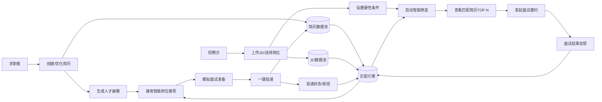
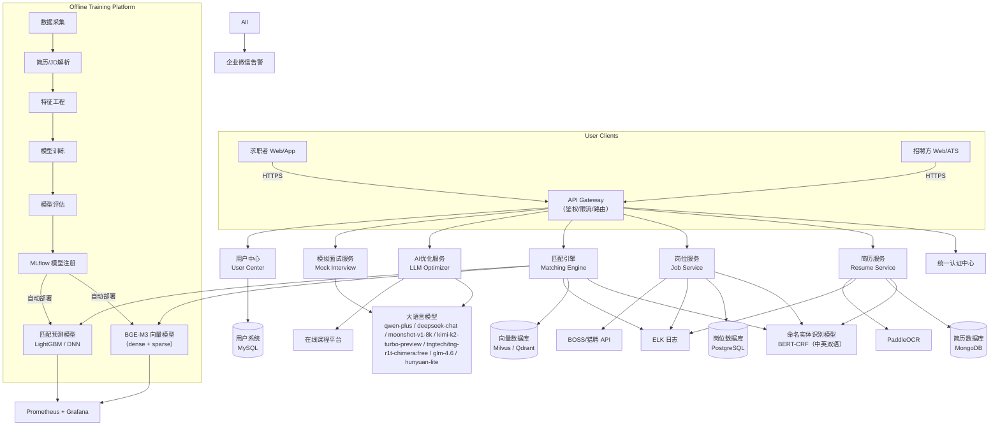
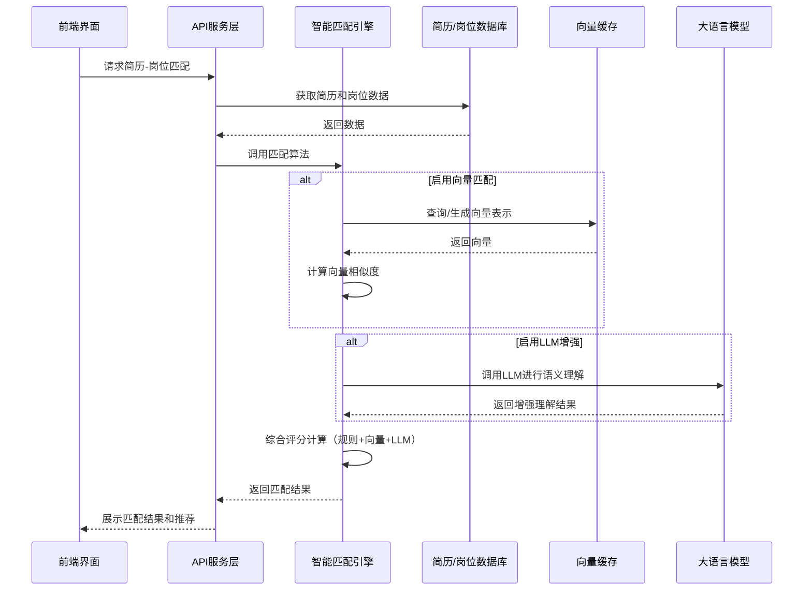

## 🎯 一、项目定位

> **智能简历筛选平台**：  
> 基于大模型 + 向量语义匹配 + 可解释 AI，构建一个 **双向智能撮合系统**——
>
> - **帮招聘方**：从海量简历中高效找到高匹配人才
> - **帮求职者**：精准推荐适配岗位，并提升求职竞争力

---

## 👥 二、两大角色核心目标与价值

| 角色       | 核心目标                           | 关键结果（KR）                                                                  |
| ---------- | ---------------------------------- | ------------------------------------------------------------------------------- |
| **招聘方** | 快速、准确、低成本地找到合适候选人 | - 初筛效率提升 5x<br>- 面试通过率 ≥40%<br>- 人均筛选成本下降 60%                |
| **求职者** | 找到高匹配岗位，提升面试成功率     | - 岗位推荐点击率 ≥30%<br>- 简历优化后投递回复率 ↑50%<br>- 模拟面试满意度 ≥4.5/5 |

---

## 🔁 三、端到端业务流程（两方协同）



> ✅ **关键协同点**：
>
> - 求职者和招聘方的行为数据 → 直接驱动匹配引擎优化
> - 匹配引擎自动学习反馈数据，持续提升匹配准确性

---

## 🏗️ 四、系统架构概览



## 4.2 匹配引擎工作流程图



### 4.3 架构亮点

- **分层微服务架构**：清晰的服务边界和职责分离，便于维护和扩展
- **多模态匹配引擎**：结合规则匹配、向量匹配和语义理解，提升匹配准确性
- **向量缓存优化**：减少重复计算，提升匹配性能
- **灵活的配置系统**：支持权重调整和算法选择，适应不同场景需求
- **增强型语义理解**：集成向量匹配和可选的 LLM 增强功能，提供更准确的语义匹配
- **可插拔的算法组件**：支持通过配置启用/禁用特定匹配算法，便于实验和调优

### 4.4 智能匹配引擎技术细节

#### 4.4.1 向量匹配实现

**核心技术**：

- **模型选择**：
  - **优先模型**：BGE-M3
    - 维度：1024+
    - 支持长度：8192 tokens
    - 内存需求：至少 6GB 可用内存
    - 特点：高性能、多语言支持、语义理解能力强
  - **中文优化模型**：BAAI/bge-small-zh-v1.5
    - 维度：1024
    - 支持长度：512 tokens
    - 内存需求：至少 4GB 可用内存
    - 特点：中文处理优化、内存占用较小
  - **英文轻量模型**：sentence-transformers/all-MiniLM-L6-v2
    - 维度：384
    - 支持长度：256 tokens
    - 特点：轻量级、快速加载、英文处理优化
  - **降级机制**：根据可用内存自动选择合适的模型，确保系统在不同硬件环境下都能正常运行
- **相似度计算**：使用优化降级策略的向量模型（BGE-M3 优先）将简历和 JD 文本转换为高维向量（1024+维或根据模型调整），通过计算余弦相似度评估语义匹配度
- **性能优化**：实现向量缓存机制，避免重复计算

**关键组件**：

```python
# 向量模型初始化
def _init_vector_model():
    if not VECTOR_MATCHING_AVAILABLE:
        print("[Matcher] Vector matching dependencies not available.")
        return

    try:
        # 加载BGE-M3向量模型
        global VECTOR_MODEL
        VECTOR_MODEL = SentenceTransformer("BAAI/bge-m3")
        print("[Matcher] Vector model initialized successfully.")
    except Exception as e:
        print(f"[Matcher] Failed to initialize vector model: {e}")

# 向量相似度计算
def calculate_vector_similarity(resume_text: str, job_text: str) -> float:
    if not MODEL_CONFIG['enable_vector_matching'] or not VECTOR_MATCHING_AVAILABLE:
        return 0.0

    try:
        # 生成向量表示
        resume_embedding = VECTOR_MODEL.encode(resume_text)
        job_embedding = VECTOR_MODEL.encode(job_text)

        # 计算余弦相似度
        similarity = cosine_similarity(
            [resume_embedding], [job_embedding]
        )[0][0]

        # 应用阈值过滤
        if similarity < MODEL_CONFIG['vector_similarity_threshold']:
            similarity = 0.0

        return similarity
    except Exception as e:
        print(f"[Matcher] Vector similarity calculation error: {e}")
        return 0.0
```

#### 4.4.2 LLM 增强功能（两个激活提供者）

**核心技术**：

- **模型集成**：支持 Qwen3-Max（Qwen）、deepseek-chat（DeepSeek）、moonshot-v1（Moonshot）、kimi-k2-turbo-preview、tngtech/tng-r1t-chimera:free、glm-4.6、hunyuan-lite、OpenRouter 等；默认不使用 OpenAI
- **模型链式调用**：支持配置多组模型链，可组合使用多个模型，提高分析结果的准确性和可靠性
- **区域适配**：根据不同地区（国内/国际）自动选择合适的模型和 API 地址
- **优先级策略**：按区域优先顺序自动选择两个可用提供者参与链式分析与融合（国际优先 Moonshot/OpenRouter，本地优先 Qwen/DeepSeek/Doubao）
- **语义增强**：利用 LLM 深度理解简历和岗位的语义关系
- **请求日志**：记录提供者、模型、URL、请求/响应长度，便于审计与调试
- **可配置性**：通过配置文件控制是否启用 LLM 增强

#### 4.4.3 多维度评分机制

**评分维度**：
| 维度 | 权重 | 说明 | 实现方式 |
|------|------|------|----------|
| 技能匹配 | 0.25 | 核心技能匹配程度 | 规则匹配 + 向量增强 |
| 学历要求 | 0.10 | 学历满足度 | 规则匹配 |
| 工作年限 | 0.15 | 年限匹配度 | 规则匹配 |
| 职位相关性 | 0.10 | 职位匹配度 | 规则匹配 |
| 关键词匹配 | 0.10 | 关键术语匹配 | 规则匹配 |
| 证书匹配 | 0.05 | 相关证书匹配 | 规则匹配 |
| 语言能力 | 0.05 | 语言要求匹配 | 规则匹配 |
| 熟练度 | 0.05 | 技能熟练度匹配 | 规则匹配 |
| 量化指标 | 0.05 | 工作成果量化匹配 | 规则匹配 |
| 向量相似度 | 0.10 | 语义相似度 | 向量模型计算 |

#### 4.4.4 命名实体识别模型

**核心技术**：

- **预训练模型选择**：

  - 中文：使用 `uer/roberta-base-finetuned-cluener2020-chinese`，专为中文命名实体识别任务微调
  - 英文：使用 `dslim/bert-base-NER`，专为英文命名实体识别任务微调

- **模型架构**：

  - 基础模型：BERT（中文和英文版本）
  - 序列标注层：条件随机场（CRF）
  - 支持多种实体类型的识别（个人信息、教育背景、工作经历、技能等）

- **实体提取流程**：
  - 文本预处理（分词、编码）
  - 特征提取（使用 BERT 模型）
  - 序列标注（使用 CRF 层）
  - 实体合并（合并重叠或相邻的相同类型实体）

#### 4.4.5 配置管理

**核心配置项**：

- **模型配置**：控制向量匹配、LLM 增强和 NER 模型（中文：uer/roberta-base-finetuned-cluener2020-chinese，英文：dslim/bert-base-NER）的启用状态
- **权重配置**：调整各评分维度的重要性
- **阈值配置**：设置向量相似度等关键指标的阈值

**配置示例**：

```python
# 模型配置
MODEL_CONFIG = {
    "enable_vector_matching": True,
    "enable_llm_enhancement": False,
    "vector_similarity_threshold": 0.3
}

# 评分权重配置
WEIGHTS = {
    "skills": 0.25,
    "degree": 0.10,
    "years": 0.15,
    "position": 0.10,
    "keywords": 0.10,
    "certs": 0.05,
    "languages": 0.05,
    "proficiency": 0.05,
    "metric": 0.05,
    "vector_similarity": 0.10  # 向量相似度权重
}
```

### 4.5 系统扩展性设计

**可插拔算法框架**：

- 支持通过配置文件动态启用/禁用特定匹配算法
- 支持自定义评分维度和权重
- 支持算法组件的独立开发和测试

**性能优化策略**：

- 向量计算结果缓存
- 批量处理机制
- 异步计算支持
- 分布式部署能力

---

## 📊 五、各模块详细设计

### 5.1 **求职者端流程**

| 步骤     | 目标                       | 输出                        | 技术实现                |
| -------- | -------------------------- | --------------------------- | ----------------------- |
| 简历创建 | 结构化输入，便于 AI 理解   | 标准化 JSON 简历            | React 表单 + 自动保存   |
| AI 优化  | 提升简历专业性与关键词覆盖 | 优化建议 + 3 版风格         | LLM Prompt（见前文）    |
| 人才画像 | 建立自我认知               | 技能图谱 + 职级定位         | 实体抽取 + 对标库       |
| 岗位推荐 | 精准匹配                   | Top 20 岗位列表（含匹配分） | BGE-M3 + 加权融合       |
| 模拟面试 | 提升面试能力               | 10 题 + AI 点评             | 岗位面经库 + LLM 生成   |
| 投递追踪 | 降低焦虑                   | 投递看板 + 拒因分析         | 状态同步 + NLP 解析拒信 |

---

### 5.2 **招聘方端流程**

| 步骤     | 目标           | 输出                | 技术实现                      |
| -------- | -------------- | ------------------- | ----------------------------- |
| JD 录入  | 结构化岗位要求 | 解析后的 JD 特征    | 规则 + LLM 抽取               |
| 硬性过滤 | 快速剔除不符者 | 初筛简历池          | 规则引擎（SQL/DSL）           |
| 语义匹配 | 深度契合度评估 | 匹配分 + 排名       | BGE-M3 dense + sparse         |
| 三级补筛 | 识别潜力与风险 | 综合评语 + 风险标签 | LLM 深度分析（见前文 Prompt） |
| 结果呈现 | 辅助决策       | 简历卡片 + 面试建议 | 前端聚合展示                  |
| 效果反馈 | 闭环优化       | 标记“误匹配”        | 按钮反馈 + 自动入池           |

---

## ⚠️ 六、关键难点与应对策略

| 难点                  | 风险                     | 解决方案                                                             |
| --------------------- | ------------------------ | -------------------------------------------------------------------- |
| **1. 数据冷启动**     | 初期无标注数据，模型不准 | - 用规则+LLM 生成伪标签<br>- 与招聘平台合作获取脱敏数据              |
| **2. 数据泄露风险**   | 简历含敏感信息           | - 严格脱敏（姓名 → 张\*，电话 →138\*\*\*\*1234）<br>- 私有化部署选项 |
| **3. 模型偏见**       | 对某些学校/性别打分低    | - 公平性检测（Fairlearn）<br>- 特征消偏（去除性别/年龄字段）         |
| **4. 求职者信任**     | “为什么推荐这个岗？”     | - 可解释性：展示匹配关键词<br>- 提供“不感兴趣”反馈按钮               |
| **5. 多格式简历解析** | PDF/扫描件解析错误       | - 多引擎融合（PyPDF2 + PaddleOCR + LayoutParser）<br>- 人工校验入口  |

---

## 💡 七、创新点分析（差异化优势）

| 创新维度     | 传统系统               | 本平台                                             |
| ------------ | ---------------------- | -------------------------------------------------- |
| **匹配机制** | 关键词匹配 or 简单规则 | **BGE-M3 语义向量 + sparse 关键词 + LLM 深度补筛** |
| **双向赋能** | 仅服务招聘方           | **同时优化求职者简历 + 推荐岗位**                  |
| **闭环学习** | 模型静态               | **HR 反馈 → 自动入负样本池 → 周级迭代**            |
| **体验设计** | 黑盒打分               | **可解释匹配理由 + 模拟面试 + 竞争力分析**         |
| **部署灵活** | SaaS only              | **支持公有云 API + 私有化 SDK**                    |

> ✨ **最大创新**：  
> **将“简历筛选”从单向过滤工具，升级为“人才-岗位智能撮合生态系统”**

---

## 📈 八、成功度量指标（OKR 示例）

### Objective：打造行业领先的智能简历匹配平台

| Key Result                           | 目标值 |
| ------------------------------------ | ------ |
| KR1：招聘方平均初筛时间 ≤ 10 分钟/岗 | 达成   |
| KR2：求职者岗位推荐点击率 ≥ 30%      | 达成   |
| KR3：匹配模型 AUC ≥ 0.85             | 达成   |
| KR4：支持 3 家头部企业私有化部署     | 达成   |

---

## 📄 九、完整产品 PRD 模板

# 智能简历筛选平台

**Product Requirements Document (PRD)**  
版本：1.0  
日期：2025 年 11 月 24 日  
作者：[你的名字]

---

### 1. 文档概述

| 项目         | 内容                                                                 |
| ------------ | -------------------------------------------------------------------- |
| **产品名称** | 智能简历筛选平台                                                     |
| **目标用户** | - 招聘方（HR/用人经理）<br>- 求职者（应届生/职场人）                 |
| **核心价值** | 通过 AI 实现“人才-岗位”双向精准匹配，提升招聘效率与求职成功率        |
| **成功指标** | - 招聘方初筛时间 ↓70%<br>- 求职者投递回复率 ↑50%<br>- 模型 AUC ≥0.85 |

---

### 2. 产品目标

#### 2.1 战略目标

- 打造国内领先的 AI 驱动招聘基础设施
- 构建“简历-岗位”智能撮合生态闭环

#### 2.2 用户目标

| 角色   | 目标                                          |
| ------ | --------------------------------------------- |
| 招聘方 | 快速从 10,000 份简历中找到 100 个高匹配候选人 |
| 求职者 | 获得个性化岗位推荐，并提升面试通过率          |

---

### 3. 功能需求详述

#### 3.1 求职者端功能

| 模块     | 功能点                               | 优先级 | 说明                          |
| -------- | ------------------------------------ | ------ | ----------------------------- |
| 简历创建 | 在线表单填写、PDF 导入、草稿自动保存 | P0     | 支持 8 大模块结构化输入       |
| AI 优化  | 一键优化、岗位定制、问题诊断         | P0     | 基于 LLM 生成专业表述         |
| 人才画像 | 技能图谱、职级定位、竞争力雷达图     | P1     | 对标行业同岗人群              |
| 岗位推荐 | 智能匹配、多维排序、过滤器           | P0     | BGE-M3 语义分 + 薪资/通勤加权 |
| 模拟面试 | 生成 10 题、AI 点评、参考答案        | P1     | 支持语音/文字答题             |
| 投递追踪 | 看板管理、拒信分析、学习建议         | P2     | 降低求职焦虑                  |

#### 3.2 招聘方端功能

| 模块     | 功能点                          | 优先级 | 说明                    |
| -------- | ------------------------------- | ------ | ----------------------- |
| JD 管理  | 上传/解析 JD、设置硬性条件      | P0     | 自动提取学历/年限等规则 |
| 智能筛选 | 三级漏斗：规则 → 语义 →LLM 补筛 | P0     | 输出匹配分+风险标签     |
| 结果呈现 | 简历卡片、面试建议、批量操作    | P0     | 支持导出/标记/邀约      |
| 效果反馈 | “误匹配”标记、面试结果回填      | P1     | 驱动模型迭代            |

---

### 4. 非功能需求

| 类别       | 要求                                                |
| ---------- | --------------------------------------------------- |
| **性能**   | - 简历解析 ≤3s<br>- 匹配响应 ≤1s（Top 100）         |
| **安全**   | - GDPR/《个人信息保护法》合规<br>- 敏感信息脱敏存储 |
| **可用性** | - 系统可用性 ≥99.9%<br>- 支持私有化部署             |
| **扩展性** | - 支持每日 10 万+简历处理<br>- 模型可插拔替换       |

---

### 5. 数据流与关键指标

#### 5.1 核心数据流

```
求职者简历 → 解析 → 特征提取 → 向量化 → Milvus
招聘方JD   → 解析 → 特征提取 → 向量化 → 匹配引擎
匹配结果 → 前端展示 → 用户反馈 → 负样本池 → 模型再训练
```

#### 5.2 关键业务指标（KPI）

| 指标               | 目标值      | 监控频率 |
| ------------------ | ----------- | -------- |
| 简历-JD 匹配 AUC   | ≥0.85       | 每日     |
| 招聘方人均筛选时间 | ≤10 分钟/岗 | 每周     |
| 求职者岗位点击率   | ≥30%        | 每日     |
| 模型周迭代次数     | ≥1 次       | 每周     |

---

### 6. 项目里程碑

| 阶段         | 时间    | 交付物                               |
| ------------ | ------- | ------------------------------------ |
| MVP 开发     | 2025 Q4 | 求职者简历+岗位推荐 + 招聘方基础筛选 |
| 模型 V1 上线 | 2026 Q1 | BGE-M3 匹配 + LLM 优化               |
| 私有化支持   | 2026 Q2 | Docker 镜像 + 客户部署包             |
| 生态扩展     | 2026 Q3 | 对接课程平台 + 面经库                |

---

### 7. 风险与应对

| 风险           | 应对措施                      |
| -------------- | ----------------------------- |
| 数据冷启动     | 用规则+LLM 生成初始训练集     |
| 模型偏见       | 公平性检测 + 特征消偏         |
| 用户信任不足   | 提供可解释匹配理由 + 反馈入口 |
| 多格式解析失败 | 多引擎融合 + 人工校验通道     |

---

> ✅ **PRD 使用说明**：
>
> - 技术团队：重点关注第 3、4、5 节
> - 产品/运营：重点关注第 2、3、6 节
> - 管理层：重点关注第 1、2、6 节
