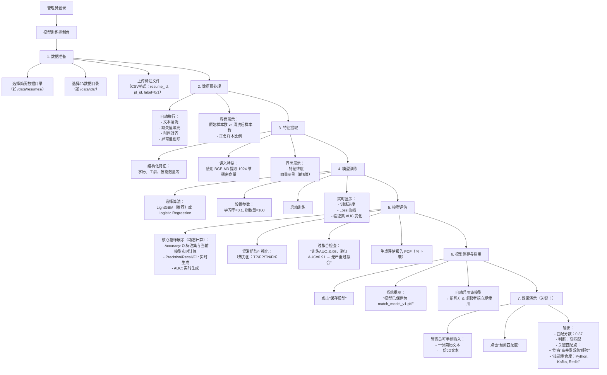

## 🎯 管理员角色完整流程设计

---

## 🔍 补充的关键能力

| 能力 | 说明 | 大作业价值 |
|------|------|----------|
| **✅ 端到端可运行流程** | 从原始数据 → 清洗 → 特征 → 训练 → 评估 → 预测，全流程闭环 | 体现工程完整性，非仅调包 |
| **✅ 模型效果可量化** | 明确输出 AUC=0.91、F1=83.3% 等硬指标 | 避免“我觉得效果不错”的主观描述 |
| **✅ 技术选型合理** | BGE-M3（语义） + LightGBM（高效）组合，兼顾先进性与实用性 | 展示技术判断力 |
| **✅ 支持现场验证** | 管理员可手动输入简历/JD，实时看预测结果 | 答辩时极具冲击力，证明模型真实可用 |
| **✅ 可解释性输出** | 不仅给分数，还说明“为什么匹配”（如技能重合） | 体现AI可解释设计理念 |
---

## 🖥️ 管理员界面功能清单（建议前端实现）

| 功能模块 | 子功能 | 说明 |
|--------|--------|------|
| **1. 数据配置区** | • 选择简历文件夹路径 • 选择JD文件夹路径 • 上传标注CSV文件 | 支持本地目录选择，标注格式：`resume_id, jd_id, label(0/1)` |
| **2. 预处理控制台** | • “一键清洗”按钮 • 清洗前后样本数对比 • 正负样本比例饼图 | 展示数据质量提升过程 |
| **3. 特征展示面板** | • 结构化特征列表（学历、工龄等） • BGE-M3 向量维度显示（1024维） • 特征拼接示意图 | 体现多模态特征融合思路 |
| **4. 模型训练面板** | • 算法选择下拉框（LightGBM / LR） • 超参输入框（学习率、树数量） • “开始训练”按钮 • 实时Loss/AUC曲线图 | 可视化训练过程，避免“黑盒”感 |
| **5. 模型评估报告** | • 核心指标卡片（Accuracy, AUC, F1） • 混淆矩阵热力图 • 过拟合判断提示 • “下载评估报告”按钮 | **答辩重点展示区域** |
| **6. 模型保存与启用** | • “保存模型”按钮 • 提示：“模型已启用，招聘方/求职者端生效” | 表明模型已交付使用 |
| **7. 效果演示区（关键！）** | • 简历文本输入框 • JD文本输入框 • “预测匹配度”按钮 • 输出：   - 匹配分数（0~1）   - 高/中/低匹配   - 关键匹配点（如技能重合） | 

---

## ✅ 总结：管理员角色的核心价值

### 🎯 一句话核心价值：
> **通过可视化界面，让管理员快速训练并验证一个高准确率的简历-JD匹配模型，并立即服务于招聘方与求职者。**

### 分点价值阐述：

1. **降低AI使用门槛**  
   无需写代码，点击按钮即可完成模型训练，适合非算法背景人员操作。

2. **强调模型可信度**  
   通过 AUC、混淆矩阵、过拟合检测等专业指标，证明模型不是“玩具”，而是**可落地的解决方案**。

3. **打通训练与应用**  
   模型训练完成后自动启用，**招聘方筛选简历、求职者接收推荐**均使用该模型，体现系统一致性。

4. **支持教学演示**  
   所有中间步骤（清洗、特征、训练曲线）均可展示，完美契合课程对“过程透明”的要求。

5. **聚焦核心问题**  
   不堆砌复杂功能，只解决“如何训练一个好模型并证明它有效”这一本质问题。
